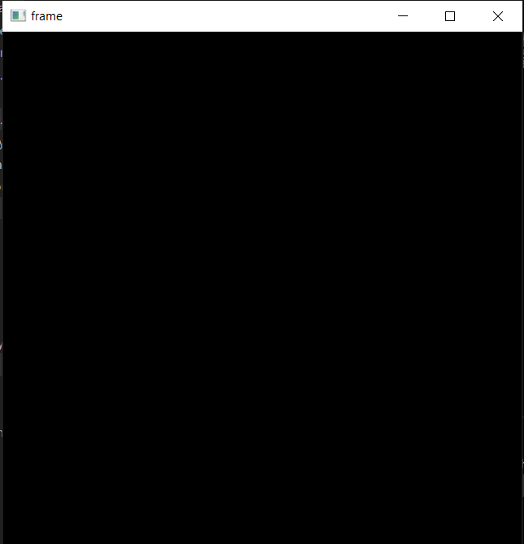
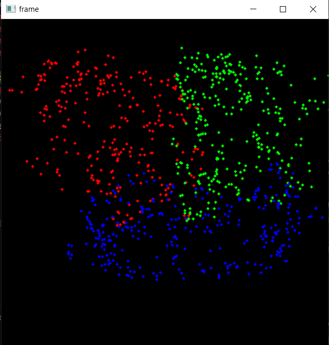
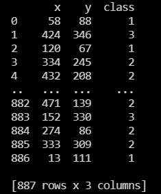

# Custom-Dataset-Generator
This is a quick and easy way to generate some random classification data to test out our ML algorithms.

This python script  uses OpenCV to allow users to create their own custom dataset for their classification algorithms.

Users can draw out each their clusters/classes of datapoints in a 2D plane and in the mean time the code collects all the datapoints and creates a proper csv file out of it which is ready for a machine learning classification model.

## Working:
(Please install the necessary depedencies before running the python file)
Dependencies needed:
* cv2
* numpy 
* random
* pandas

Upon running the python file provides a black canvas is displayed:

To make data:
* With the left mouse button click you will be able to starting drawing out your points.
* With one more click drawing of that particular cluster stops.
* Again on a mouse click, we can start drawing other clusters.
* Upto 4 such clusters can be drawn at the moment(This can be easily expanded - Feel free to do so😊🙂)

An example for the canvas after drawing is:

Upon finishing, press any key.

The output will be saved as a csv file:

Example:

## Thank you guys!!!
## Feel Free to fork and add features
# Happy coding!!!
